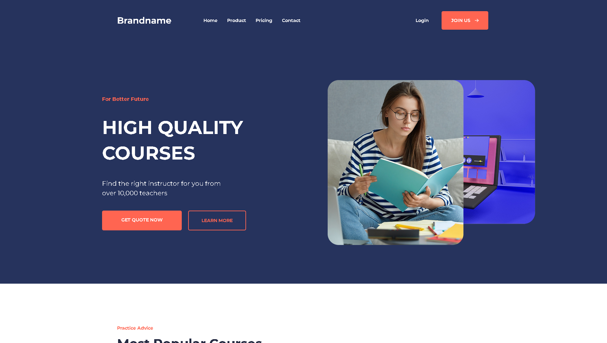

# 📘 Landing Page Educacional 

Projeto desenvolvido por mim, do zero, utilizando apenas **HTML5** e **CSS3**, com foco em boas práticas de estruturação, responsividade e design visual moderno. 

## 💡 Sobre o projeto

Essa landing page simula uma plataforma educacional, com seções como:
- Hero com chamada principal
- Cards de cursos e professores
- Tabela de preços
- Depoimentos de usuários
- Newsletter e rodapé

## 🛠 Tecnologias usadas

- HTML5
- CSS3 
- Google Fonts 

## 📱 Responsividade

O site foi testado e adaptado para:
- 📱 Celulares
- 💻 Laptops
- 🖥️ Telas grandes

## 👨‍💻 Autor

Desenvolvido por Tiago Lima  
🔗 [Meu GitHub](https://github.com/ti-limaa)

